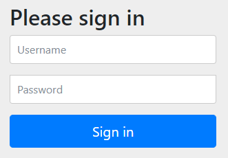
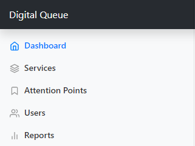
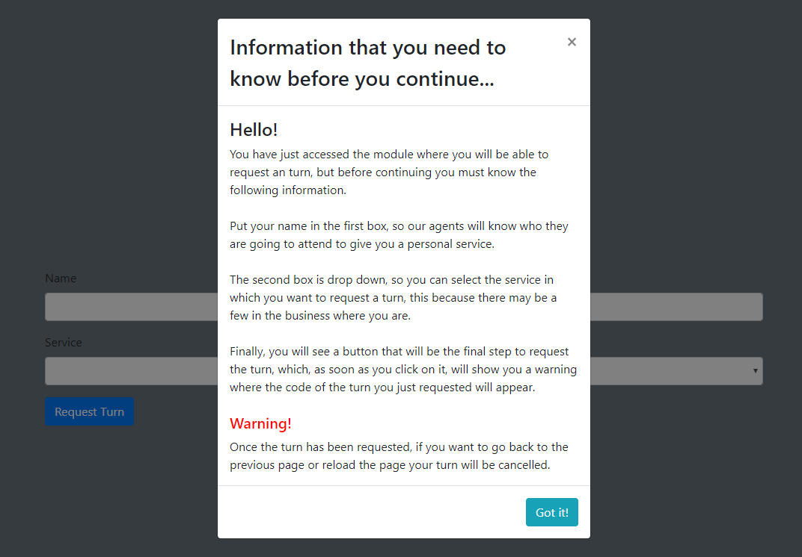
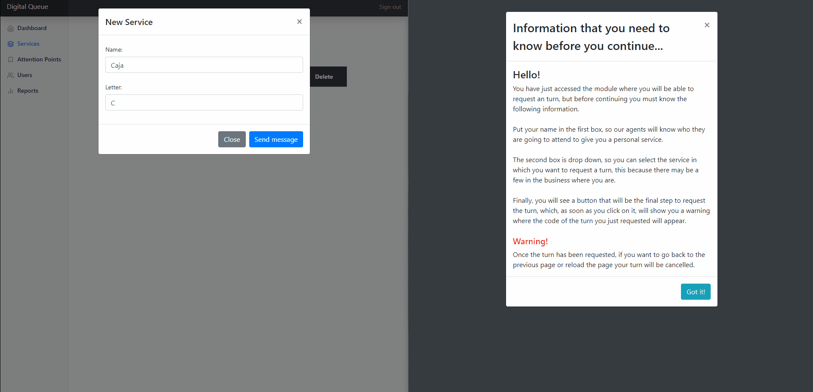
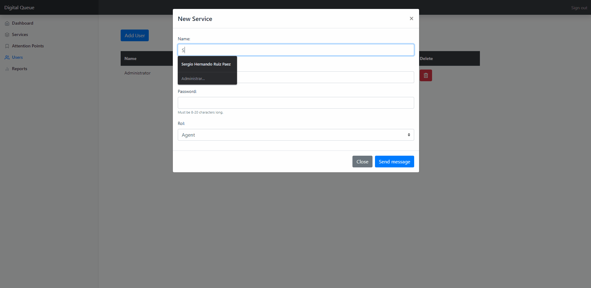

# DigitalQueue

Project developed by Daniel Vela, Sergio Ruiz and Wilson Melo for the course of Software
Architecture of the Colombian School of Engineering for the 2019-II semester.

## Problem to be solved

The current solutions for queing customers in businesses are limited in the aspects of customization and customer interactivity. The vendors of these kind of solutions offer systems that cannot be fully customized, depend on additional physical devices like a turn dispenser and can become stale or obsolete pretty quickly.

Usually, other solutions are focused in a particular business model, allowing little to no customization and thus reducing the number of potential clients. Additionally, these turns are based on *first come-first serve* model in which turns cannot be modified due to any possible circumstance (such as a client leaving the business before the correspondent attention is given), this causes dead time periods in which a service representative cannot attend anybody and clients lose their patience and leave, giving room for more similar incidents.

Additionally, these systems offer close to no feedback in terms of performance of the customer attention system.

## Description

The purpose of this project is to implement a digital turn system that is ready to configure and use in any kind of organization. This project should ease customer attention, remove/reduce dead time periods between clients, give full statistic reports in indicators of performance, customer satisfaction and possible bottlenecks or problematic areas, etc, all through a fully customizable, ready to use platform that can be easily adapted to any kind of business model.

The final aggregate value is based in the reports feature: a business can get immediate feedback in terms of performance, customer satisfaction and possible bottlenecks or problematic areas.

## User guide
Digital Queue will provide a friendly environment for easy handling by the organization as well as the user.

Once the software and login credentials are delivered for the first time, they can be accessed using the *Sign In* option.

The dashboard that the administrator has, contains all the options so that this person can manage the whole system from this account.

From this dashboard the administrator can keep track in *real time* of the shifts that are waiting to be attended by all the services, the completed ones and more options. 

In the same way, being an administrator, you can create, edit and delete services, attention points and system users.

When a user wants to close his session, just go to the *Sign out* button and click on it and your session will be closed.

Once an agent has been created, in the same way that the administrator can access the system, the system can do it, but you will find that your dashboard only consists of a tab that allows you to manage the turns that have been assigned to the attention point to which it belongs.

From here you can manage the shifts as you need, having the opportunity to call the next one, complete the one being attended or simply cancel it, all this in the company of notifications with each action.

Now, if it is a user who is making use of the software in function of consuming his main service, there is only one view for this one, where he can request a turn in the service that needs it.

## Architecture

Our solution is to deploy standalone Spring Boot applications compiled from a base code source (this repository) for each business to store their queues, users and configurations, with its own database and URL to access. Only employees can access the company's DigitalQueue deployment.

To begin, and for demonstration purposes, the application will be deployed to Heroku, where a PostgreSQL database will be available for the user to store data.

## Functionality Testing
### Create a new service and check its existence at the time of requesting a turn.

### Request an turn and verify its existence at the point of care that will handle it.

### Request two turns at the same time in the same service.

### Create new user in real-time.

### Verify security of access to endpoints without authentication.

